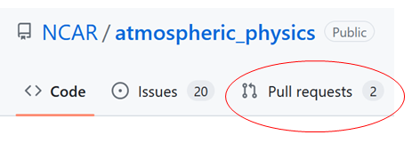
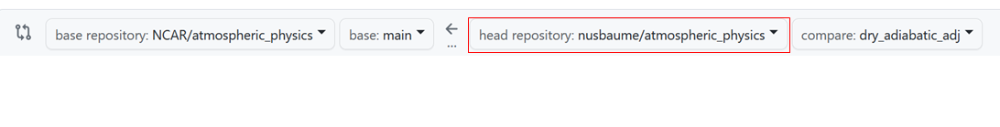
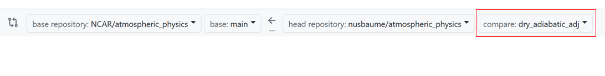

# Development workflow for atmospheric_physics

This page describes the general workflow for adding new developments to the [atmospheric_physics](https://github.com/ESCOMP/atmospheric_physics) repo, which is the location of all CGD-developed CCPP-ized physics schemes and Suite Definition Files (SDFs).

## Workflow summary

The general workflow for adding a feature, bug-fix, or modification to atmospheric_physics is as follows:

  1.  [**Open an issue.**](#1-open-an-issue)
  1.  **[Add your code modifications](#3-update-your-code-with-changes-from-the-official-repo) to a branch on your [fork](#2-create-a-fork-if-you-havent-already).**
  1.  **[Add/amend unit tests](#5-unit-testing)**
  1.  **[Open a PR](#6-creating-a-pull-request-pr) from your branch to the `development` branch.**
  1.  **Respond to any reviewer requests.**
  1.  **Fix any failing automated Github tests.**
  1.  **RECOMMENDED: Rerun [CAM](https://github.com/ESCOMP/CAM/wiki/CAM-SE-Workflows#run-cam-tests) and/or [CAM-SIMA](../development/cam-testing.md#regression-testing) regression tests to ensure your updates haven't broken anything.**
  1.  **[Update `doc/NamesNotInDictionary.txt` file.](#updating-namesnotindictionarytxt-file)**
  1.  **If you know that this PR will need an official tag, then also add the [tag name](Tagging-Instructions.md/#tag-naming-conventions) to the PR description.**
  1.  **If this PR contains updates that will impact CAM, DO NOT MERGE the PR until you have been assigned a CAM tag by the CAM gatekeeper**
      - If there are associated changes to CAM-SIMA, it is also good practice to get those changes approved before merging the atmospheric_physics PR.
  1.  **Once you're ready to merge, squash the commits and merge the PR (e.g. the "squash and merge" option).**

If you need an official tag for your new additions, then once your `development` PR has been merged you will need to do the following:

  1.  **Open a PR that merges the atmospheric_physics `development` branch into `main`.  Ensure that the PR description lists the title and number of every PR that went into `development` since the last update to `main`.**
  2.  **Fix any failing tests.  This includes tests on the target host models that will be using the new tag.**
  3.  **Merge (do not squash!) the PR.**
  4.  **[Tag](Tagging-Instructions.md) the new merge commit.**

## Workflow details

The following sections describe various workflow actions in more detail.

### 1.  Open an issue.

It is generally recommended to [open an issue](https://github.com/ESCOMP/atmospheric_physics/issues/new) for any new feature that will be added or bug that has been found that will need to be fixed.  There is currently no official requirement on what should be contained within the issue text, so generally just put any information you think might be relevant.

### 2.  Create a fork (if you haven't already).

We recommend creating a fork of the atmospheric_physics repo, and doing all of the development there.  Instructions for how to set up a fork, and how to configure git in general, can be [found here](../development/git-basics.md).

### 3. Update your code with changes from the official repo.

**1.  Clone your repo and add an upstream remote**

```
   git clone https://github.com/<GitHub userid>/atmospheric_physics
   cd atmospheric_physics
   git remote add upstream https://github.com/ESCOMP/atmospheric_physics.git
```

**2.  Fetch the latest version of the ESCOMP repo:**

```
   git fetch upstream
```

**3.  Rebase your local forked branch to the ESCOMP version.  For example, assuming you are working on a local branch called `feature`:**

```
   git checkout feature
   git rebase upstream/development
```

Please note that you may also do a `git merge upstream/development` if you feel more comfortable with that method.

If you then want to update the `feature` branch on your Github fork, then push your changes like so:

rebase:
```
   git push -f
```

merge:
```
   git push
```

Of course, if you run into any problems with either method then please create a discussion post that contains your message and someone will try and assist you.

### 4. Committing code

**1. Create a new branch off of the ESCOMP development branch:**

```
   git checkout -b cool_new_feature upstream/development
```

where `cool_new_feature` is an example branch name (you can use any name you want).  Next, push that new branch to your fork on Github:

```
   git push -u origin cool_new_feature
```

**2.  Apply your code modifications and/or script additions, and perform at least one test making sure that your modifications work as expected.**

**3.  Add all the files that you want to commit.  There are multiple ways to do this, but one of the safer ways is to first check your status:**

```
   git status
```

This will provide a list of all modified files.  For each one of those files whose modifications you want to add to the main package, you will do the following:

```
   git add awesome_scheme.meta
```

Where `awesome_script.meta` should be replaced with whatever your file name is.  Do this for each file you want to include.  If you are confident that every file listed by `git status` needs to be added, then you can do it all at once by doing:

```
   git add -A
```

You can then type `git status` again, at which point all of the files you added should be "staged" for commit.

**4.  Commit your changes to your local branch:**

```
   git commit -m "<message>"
```

where `<message>` is a short descriptor or sentence stating what the commits are for, e.g. "Fixed color bar bug" or "Added significance hatching".

**5.  Push your committed changes to your fork:**

```
   git push
```

### 5. Unit Testing

Also make sure that the unit tests all pass and verify if your changes can be unit tested and added to the test suite. 

Atmospheric_physics uses [pFUnit](https://github.com/Goddard-Fortran-Ecosystem/pFUnit) as the toolkit for unit testing Fortran codes.  It is similar to [googletest](https://github.com/google/googletest) in providing an explicit interface/setup procedure to make it clear what you are testing and how.

#### Running the unit test suite

To run the tests, you will need to build pFUnit manually (see either the github workflow for atmospheric_physics or the [pFUnit documentation](https://github.com/Goddard-Fortran-Ecosystem/pFUnit?tab=readme-ov-file#building-and-installing-pfunit) on how to build) and then use that to build the tests:

```bash
$ cmake -DCMAKE_PREFIX_PATH=<path_to_pfunit>/build/installed \
        -S./test/unit-test \
        -B./build
$ cd build && make
$ ctest
```
This should print something along the lines of
```bash
100% tests passed, 0 tests failed out of 1
```

or show an error if a test failed.

#### Adding unit tests

**For modules that are currently being built with CMake, are independent of any external library modules, and/or are dependent only on other modules that are already unit tested, it is recommended to add relevant tests that cover those new lines of code. If this doesn't apply to your module(s), skip this section.**

As unit test development is just as much an art form as source code development, we will defer a discussion on what constitutes as "good tests" to other sources such as [MS.net](https://learn.microsoft.com/en-us/dotnet/core/testing/unit-testing-best-practices), [abseil](https://abseil.io/resources/swe-book/html/ch12.html), [googletest](https://github.com/google/googletest/blob/main/docs/primer.md), [Martin Fowler](https://martinfowler.com/testing/), etc.  Just like with source code, philosophical/technical conventions will evolve with the code over time as well.

##### Adding a new pFUnit test

If you are adding a new file, add it to the list of files being built by the `test/unit-test/CMakeLists.txt`, and if it builds successfully, add a corresponding unit test.  The current workflow is to take your new file in `schemes/{path_to_file}/new_file.F90` and add a corresponding test file in `test/unit-test/tests/{path_to_file}/test_{new_file}.pf`.

To add a test:

  1.  Ensure you need to have a currently existing CMake infrastructure.
  2.  Add the code being tested added to a library via `add_library(LIBNAME ...)` in the `test/unit-test/CMakeLists.txt` file.
  3.  Create a new pFUnit test file to a corresponding directory matching the source file path into the unit-test directory.  For example, if your update added the file `schemes/utilities/new_file.F90`, create a new test file called `test/unit-test/tests/utilities/test_new_file.pf`.
  3.  Add `add_pfunit_ctest(TESTNAME TEST_SOURCES test_new_file.pf LINK_LIBRARIES LIBNAME)` in the `CMakeLists.txt` file in the test directory corresponding to the new test file (ex. `test/unit-testing/tests/utilities/CMakeLists.txt` in this example).
  4.  Add subroutines to the `test_new_file.pf` file of the form:
```fortran
@test
subroutine test_added_element_equals_get_element()
  use funit
  use module_under_test_mod
   ...
   @assertEqual(expectedValue, atualValue)
```
Additional CMake integration details as well as the different assertion methods can be found in pFUnit's [github](https://github.com/Goddard-Fortran-Ecosystem/pFUnit) documentation and the [pFUnit demo](https://github.com/Goddard-Fortran-Ecosystem/pFUnit_demos) repository as well.

Currently, only certain `utilities` modules are being tested but this will expand to the rest of atmospheric_physics so check the files being built by the `test/unit-test/CMakeLists.txt` file regularly to see if you are modifying a file currently being tested.

At a minimum, unit tests for ESCOMP source code should:

  1.  Keep the setup code to the absolute minimum needed to effectively assert object/state data (ie, each line before calling `assert` statements should be modifying or preparing state data/objects to be modified exactly as a client or user would do).
  2.  Only be 1 block/set of `assert` statements per test.  If there are multiple sets of `assert` statements with module API calls in between each set, that _probably_ would constitute a new test with a different name.
  3.  Have as explicit of names as possible.  There are going to be hundreds of names in each test report and having the ability for a reviewer/contributor to be able to look at a test and intuitively understand what said test is doing is paramount (this is obviously going to vary slightly based on preference but the goal is to have a test name be as intuitive as possible).
  4. Have clear and consise comments on what is being tested above each set of assert statements.

You can find a unit testing example at the [bottom of this page](#unit-testing-example).

### 6. Creating a Pull Request (PR)

**1.  Go to the [ESCOMP atmospheric_physics repo](https://github.com/ESCOMP/atmospheric_physics), and click on the "Pull requests" tab.**



**2.  There, you should see a "New pull request" button, which you should click.**

 

**3.  On the new "Compare changes" page, you should see a "compare across forks" link, which you should click.**

 

**4.  You should now see two new pull down boxes (to the right of an arrow).  Using those pull down boxes, select the "development" branch of the ESCOMP repo and select your fork (which should be `<username>/atmospheric_physics`):**

 

  **Then select the branch which contains the new commits:**

 

**5. You should then see a list of all the different modifications.  If they generally look correct to you, then click the "Create pull request" button.**

 

**6. A new page should appear.  In the first text box add the title of your Pull request.  The second text box should contain additional fields that you should fill out to the best of your ability.**

**7.  If you are contributing something into development that needs to go into the `main` branch quickly then please make it known in the PR description.  Also add the eventual tag name to the PR description.**

**8.  Add any relevant labels to the Pull request, add yourself as the assignee, and add any reviewers you would like to have.  Otherwise the core SE team will add reviewers for you.**

**9.  Fix any failing tests that show up on Github.**

**10.  If you get any change requests during code review, then simply apply those changes in the same way you applied your original modifications.  Please note that once you `push` your changes then the PR will automatically be updated and the GitHub tests will be automatically run.**

**11.  Update the `NamesNotInDictionary.txt` file using the instructions [below](#updating-namesnotindictionarytxt-file).**

**12.  Once all reviewers sign off on your modifications, then the PR can be merged.  Congratulations!  Your code is now in atmospheric_physics!**

- If the PR is to `develop`, you should select "Squash and Merge"
- If the PR is to `main`, DO NOT squash and instead select "Merge Commit"

### Updating NamesNotInDictionary.txt file

**1.  Clone the CCPP standard names dictionary.**

`git clone https://github.com/ESCOMP/CCPPStandardNames.git`

**2. Run the "meta_stdname_check.py" script to generate a new "NamesNotInDictionary.txt" file.**

`CCPPStandardNames/tools/meta_stdname_check.py -m </path/to/atm_phys_repo> -s CCPPStandardNames/standard_names.xml > NamesNotInDictionary.txt`

Where `</path/to/atm_phys_repo>` is a path to the head of your atmospheric_physics repo with all of the relevant changes.

**3.  Replace old names file with new one.**

`cp NamesNotInDictionary.txt </path/to/atm_phys_repo>/doc/NamesNotInDictionary.txt`

Finally, once the `NamesNotInDictionary.txt` file has been updated, then commit and push it to your branch/fork on Github following the instructions in the section above.

### Removing old branches

Once your modifications have been merged into the official CAM repo, you may have no more use for the local fork branch created to develop those modifications.  In that case, you can remove the branch both from your local cloned repo and your atmospheric_physics fork:

**1.   First, make sure your local repo isn't checking out the old branch, by simply checking out a different branch:**
```
    git checkout <some_other_branch>
```
**2.   Then, remove branch from local repo:**
```
    git branch -d <branch_name>
```
**3.   Finally, remove branch from personal fork repo:**
```
    git push --delete <origin> <branch_name>
```
   You can also remove the branch via GitHub's [user interface](https://help.github.com/en/articles/creating-and-deleting-branches-within-your-repository#deleting-a-branch).


### Unit testing example
Lets say you added a utility function in `physics_tendency_updaters.F90
` to apply the pressure tendency of the atmosphere:

```fortran
subroutine apply_tendency_of_air_pressure_run(nz, p_tend, pressure, dPdt_total,   &
    dt, errcode, errmsg)
  ! Dummy arguments
  integer,            intent(in)    :: nz              ! Num vertical  layers
  real(kind_phys),    intent(in)    :: p_tend(:,:)     ! pressure tendency
  real(kind_phys),    intent(inout) :: pressure(:,:)       ! air pressure
  real(kind_phys),    intent(inout) :: dPdt_total(:,:) ! total temp. tendency
  real(kind_phys),    intent(in)    :: dt              ! physics time step
  integer,            intent(out)   :: errcode
  character(len=512), intent(out)   :: errmsg

  ! Local variable
  integer :: klev

  errcode = 0
  errmsg = ''

  do klev = 1, nz
      pressure(:, klev) = pressure(:, klev) + (p_tend(:, klev) * dt)
      dPdt_total(:, klev) = dPdt_total(:, klev) + p_tend(:, klev)
  end do

end subroutine apply_tendency_of_air_pressure_run
```

Then you would need to check that the file you've modified is being built by the tests.  You can check this in `test/unit-test/CMakeLists.txt` and see that we have:

```cmake
set(UTILITIES_SRC
    ../../schemes/utilities/state_converters.F90
    ../../schemes/utilities/static_energy.F90
    ../../schemes/utilities/physics_tendency_updaters.F90
    include/ccpp_kinds.F90
)
```

Since the file is being built, we don't have to add to this list.

Next we look for `test/unit-test/tests/utilities/CMakeLists.txt` to see if there is a matching test file:

```bash
$ ls test/unit-test/tests/utilities/
CMakeLists.txt
test_state_converters.pf
$ cat test/unit-test/tests/utilities/CMakeLists.txt
add_pfunit_ctest(utilities_tests
  TEST_SOURCES test_state_converters.pf
  LINK_LIBRARIES utilities
)
```

Because there is no matching file or test, we need to create it:

```bash
$ cat > test/unit-test/tests/utilities/test_physics_tendency_updaters.pf << EOF
@test
subroutine test_pressure_tendency_update()
  use funit
  use physics_tendency_updaters

end subroutine test_pressure_tendency_update
EOF
```

And add the ability to build/run it from the test harness by updating `test/unit-test/tests/utilities/CMakeLists.txt`:

```cmake
add_pfunit_ctest(utilities_tests
  TEST_SOURCES test_state_converters.pf test_physics_tendency_updaters.pf
  LINK_LIBRARIES utilities
```
where `test_physics_tendency_updaters.pf` has been added to the `TEST_SOURCES` list.

Now, to actually test the function, we can try something like:

```fortran
@test
subroutine test_pressure_tendency_update()
  use funit
  use ccpp_kinds, only: kind_phys
  use physics_tendency_updaters

  # Declare and setup test data with known results

  integer, parameter :: ncol = 3            ! Num columns
  integer, parameter :: nz = 3              ! Num vertical layers
  integer, parameter :: errcode = 0
  character(len=512), parameter :: errmsg = ''

  real(kind_phys) :: p_tend(ncol, nz)    ! pressure tendency
  real(kind_phys) :: pressure(ncol, nz)  ! air pressure
  real(kind_phys) :: dPdt_total(nol, nz) ! total temp. tendency
  real(kind_phys) :: dt                  ! physics time step

  pressure = 1
  p_tend = 1
  dPdt_total = 0
  dt = 1

  call apply_tendency_of_air_pressure_run(nz, p_tend, pressure, &
                                          dPdt_total, dt,       &
                                          errcode, errmsg)

  @assertEqual(2, pressure)
  @assertEqual(1, dPdt_total)
  @assertEqual(0, errcode)
  @assertEqual('', errmsg)
end subroutine test_pressure_tendency_update
```

The values should be scientifically relevant to test a valid physics case or be set up to test edge cases that the subroutine must support.

Notice that we are only testing `intent(out)` and `intent(inout)` as these are the only values that can change.

Assuming you have built the test framework according to the [instructions](#5-unit-testing), you can now run:

```bash
$ cmake \
  -DCMAKE_PREFIX_PATH=<PATH_TO_PFUNIT>/build/installed \
  -DATMOSPHERIC_PHYSICS_ENABLE_CODE_COVERAGE=ON \
  -B./build \
  -S./test/unit-test
$ cd build
$ make
$ ctest -V --output-on-failure
```

After which you should see output similar to:

```
1:  Start: <test_state_converters_suite.test_temp_to_potential_temp>
1: .   end: <test_state_converters_suite.test_temp_to_potential_temp>
1:
1: Time:         0.000 seconds
1:
1:  OK
1:  (1 test)
1:
2:  Start: <test_physics_tendency_updaters_suite.test_pressure_tendency_update>
2: .   end: <test_physics_tendency_updaters_suite.test_pressure_tendency_update>
2:
2: Time:         0.000 seconds
2:
2:  OK
2:  (1 test)
2/2 Test #1: utilities_tests ..................   Passed    0.00 sec

100% tests passed, 0 tests failed out of 1
```

If 100% of the tests pass, you're good to go!