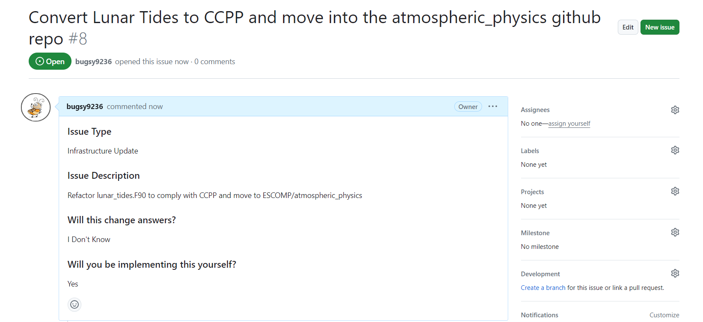
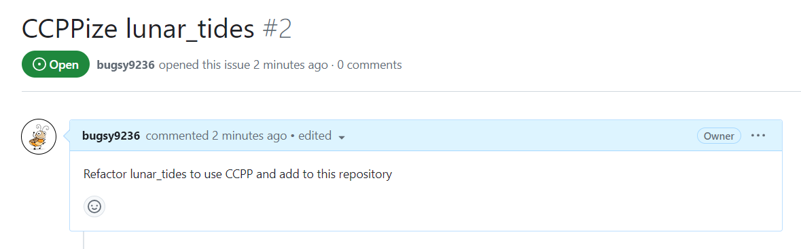

# Walkthrough Example

GASP! Our favorite imaginary software engineer **Bug E. Code** has been tasked with CCPP-izing lunar_tides*!

*Scheme doesn't do anything outside of WACCM; chosen because it won't be CCPP-ized for real any time soon (so you can see what the existing code looks like)

*Here's how Bug completes this assignment...*

## 0 - Background & prep work
1. Bug updates the [conversion spreadsheet](https://docs.google.com/spreadsheets/d/1_1TTpnejam5jfrDqAORCCZtfkNhMRcu7cul37YTr_WM/edit#gid=0) with his new assignment.

    

1. Bug opens issues in ESCOMP/CAM and ESCOMP/atmospheric_physics

    

    

1. He sets up his sandbox (with his preexisting forks) and copies the portable layer via the following commands:
```
git clone -o bugsy9236 https://github.com/bugsy9236/CAM CAM
cd CAM
git fetch --tags ESCOMP
git branch ccppize-lunar-tides ESCOMP/cam_development
git checkout ccppize-lunar-tides 
git push -u bugsy9236 ccppize-lunar-tides
bin/git-fleximod update
cd ..
git clone -o bugsy9236 https://github.com/bugsy9236/CAM-SIMA CAM-SIMA
cd CAM-SIMA
git remote add ESCOMP https://github.com/ESCOMP/CAM-SIMA
git fetch --tags ESCOMP
git branch ccppize-lunar-tides ESCOMP/development
git checkout ccppize-lunar-tides 
git push -u bugsy9236 ccppize-lunar-tides
bin/git-fleximod update
mkdir src/physics/ncar_ccpp/schemes/lunar_tides
cp ../CAM/src/physics/cam/lunar_tides.F90 src/physics/ncar_ccpp/schemes/lunar_tides/
cd src/physics/ncar_ccpp
git remote add bugsy9236 https://github.com/bugsy9236/atmospheric_physics
git fetch bugsy9236
git checkout -b ccppize-lunar-tides
git push -u bugsy9236 ccppize-lunar-tides

```

## 1 - Convert the portable layer

### 1a - Change routine names
Bug notes that there are three routines in `lunar_tides.F90`:

```
public :: lunar_tides_readnl
public :: lunar_tides_init
public :: lunar_tides_tend
```

1. He ignores `lunar_tides_readnl` for now (just leaves it as is)
1. He's *pretty sure* that `lunar_tides_init` is an init routine, but confirms this by checking where it is called in `physpkg.F90`. It is indeed called by `phys_init`, so he can comfortably keep the `lunar_tides_init` routine name as is. No action needed here yet.
1. Bug determines that `lunar_tides_tend` is called in `tphysac` (called every timestep after the coupler), so he renames `lunar_tides_tend` to `lunar_tides_run` throughout the module and proceeds

End result:
```   
public :: lunar_tides_readnl
public :: lunar_tides_init
public :: lunar_tides_run
```

### 1b - Add required `\htmlinclude` lines
Bug adds the necessary two lines above both the `lunar_tides_init` and `lunar_tides_run` routines.

```
!> \section arg_table_lunar_tides_init Argument Table
!! \htmlinclude lunar_tides_init.html
  subroutine lunar_tides_init()
    use cam_history, only: addfld
    use time_manager,only: timemgr_get_calendar_cf

    if (apply_lunar_tides) then
       if (timemgr_get_calendar_cf().ne.'gregorian') then
          call endrun('lunar_tides_init: calendar must be gregorian')
       endif
       call addfld('UT_LUNAR', (/ 'lev' /), 'A','m/s2','Zonal wind tendency due to lunar tides')
       call addfld('VT_LUNAR', (/ 'lev' /), 'A','m/s2','Meridional wind tendency due to lunar tides')
    end if

  end subroutine lunar_tides_init

  !==========================================================================
  !==========================================================================
!> \section arg_table_lunar_tides_run Argument Table
!! \htmlinclude lunar_tides_run.html
  subroutine lunar_tides_run( state, ptend )
    use time_manager, only: get_curr_date, get_julday
    use physconst,    only: pi, rearth
    use ppgrid,       only: pver
    use cam_history,  only: outfld

    type(physics_state), intent(in) :: state
    type(physics_ptend), intent(out):: ptend
    ...
```

### 1c - Clean up dummy argument dimensions
Bug makes sure no input/output variables have named dimensions in their declaration inside the routines. In this case, there are no dimensioned variables in the argument lists. So hooray!

### 1d - Use kind_phys instead of r8
Bug changes the use statement
```
use shr_kind_mod,   only: r8=>shr_kind_r8
```
to 
```
use ccpp_kinds, only: kind_phys
```
And does a find-and-replace for `r8` with `kind_phys`

`lunar_tides_run` change (old -> new):

<div class="grid" markdown>
``` 
subroutine lunar_tides_run( state, ptend )
    use time_manager, only: get_curr_date, get_julday
    use physconst,    only: pi, rearth
    use ppgrid,       only: pver
    use cam_history,  only: outfld

    type(physics_state), intent(in) :: state
    type(physics_ptend), intent(out):: ptend

    integer  :: tod,yr,mm,dd
    real(r8) :: jd,nu,lt,lun_lt

    integer :: i, k

    real(r8), parameter :: deg2hrs = 1._r8/15._r8
    real(r8), parameter :: rad2deg = 180._r8/pi
    real(r8), parameter :: rad2hrs = rad2deg*deg2hrs
    real(r8), parameter :: tod2hrs = 24._r8/86400._r8
    real(r8), parameter :: hrs2rad = 1._r8/rad2hrs
```
``` 
subroutine lunar_tides_run( state, ptend )
    use time_manager, only: get_curr_date, get_julday
    use physconst,    only: pi, rearth
    use ppgrid,       only: pver
    use cam_history,  only: outfld

    type(physics_state), intent(in) :: state
    type(physics_ptend), intent(out):: ptend

    integer  :: tod,yr,mm,dd
    real(kind_phys) :: jd,nu,lt,lun_lt

    integer :: i, k

    real(kind_phys), parameter :: deg2hrs = 1._kind_phys/15._kind_phys
    real(kind_phys), parameter :: rad2deg = 180._kind_phys/pi
    real(kind_phys), parameter :: rad2hrs = rad2deg*deg2hrs
    real(kind_phys), parameter :: tod2hrs = 24._kind_phys/86400._kind_phys
    real(kind_phys), parameter :: hrs2rad = 1._kind_phys/rad2hrs
```
</div>
### 1e - Remove use statements
Bug removes the `use` statements (except for `addfld` and `outfld` calls) and adds the relevant variables to the calling list. He also comments out any use statements from cam_history as well as any addfld and outfld calls. He also moves the namelist variable to module-level (above the `CONTAINS` statement) and passes it in to the calling list for _init

For `lunar_tides_init`:

<div class="grid" markdown>
```
subroutine lunar_tides_init()
    use cam_history, only: addfld
    use time_manager,only: timemgr_get_calendar_cf

    if (apply_lunar_tides) then
       if (timemgr_get_calendar_cf().ne.'gregorian') then
          call endrun('lunar_tides_init: calendar must be gregorian')
       endif
       call addfld('UT_LUNAR', (/ 'lev' /), 'A','m/s2','Zonal wind tendency due to lunar tides')
       call addfld('VT_LUNAR', (/ 'lev' /), 'A','m/s2','Meridional wind tendency due to lunar tides')
    end if

  end subroutine lunar_tides_init
```
```
subroutine lunar_tides_init(calendar, apply_lunar_tides_in)
    !use cam_history, only: addfld
    character(len=32), intent(in) :: calendar
    logical,           intent(in) :: apply_lunar_tides_in

    apply_lunar_tides = apply_lunar_tides_in

    if (apply_lunar_tides) then
       if (calendar.ne.'gregorian') then
          call endrun('lunar_tides_init: calendar must be gregorian')
       endif
       !call addfld('UT_LUNAR', (/ 'lev' /), 'A','m/s2','Zonal wind tendency due to lunar tides')
       !call addfld('VT_LUNAR', (/ 'lev' /), 'A','m/s2','Meridional wind tendency due to lunar tides')
    end if

  end subroutine lunar_tides_init
```
</div>

For `lunar_tides_run`:
<div class="grid" markdown>
```
subroutine lunar_tides_run( state, ptend )
    use time_manager, only: get_curr_date, get_julday
    use physconst,    only: pi, rearth
    use ppgrid,       only: pver
    use cam_history,  only: outfld

    type(physics_state), intent(in) :: state
    type(physics_ptend), intent(out):: ptend
```
```
subroutine lunar_tides_run(state, ptend, curr_date_yr, &
     curr_date_mm, curr_date_dd, curr_date_tod, julday, &
     pi, rearth, pver)
    !use cam_history,  only: outfld

    type(physics_state), intent(in) :: state
    type(physics_ptend), intent(out):: ptend
    integer,             intent(in) :: curr_date_yr
    integer,             intent(in) :: curr_date_mm
    integer,             intent(in) :: curr_date_dd
    integer,             intent(in) :: curr_date_tod
    real(kind_phys),     intent(in) :: julday
    real(kind_phys),     intent(in) :: pi
    real(kind_phys),     intent(in) :: rearth
    integer,             intent(in) :: pver
    
```
</div>

### 1f - Add error variables
Bug adds the `errmsg` and `errflg` variables to the end of the calling list and initializes them.
```
subroutine lunar_tides_run(state, ptend, curr_date_yr, &
     curr_date_mm, curr_date_dd, curr_date_tod, julday, &
     pi, rearth, pver, errmsg, errflg)
    !use cam_history,  only: outfld

    type(physics_state), intent(in) :: state
    type(physics_ptend), intent(out):: ptend
    integer,             intent(in) :: curr_date_yr
    integer,             intent(in) :: curr_date_mm
    integer,             intent(in) :: curr_date_dd
    integer,             intent(in) :: curr_date_tod
    real(kind_phys),     intent(in) :: julday
    real(kind_phys),     intent(in) :: pi
    real(kind_phys),     intent(in) :: rearth
    integer,             intent(in) :: pver
    character(len=512),  intent(out):: errmsg
    integer,             intent(out):: errflg

    ...

    errflg = 0
    errmsg = ''
```

### 1g - Replace state and ptend variables in calling list
`lunar_tides_run` includes both `state` and `ptend`! Bug starts with `state` and figures out which state variables are used in the routine

- He determines that the routine uses `state%lat`, `state%lon`, `state%ncols`, and `state%zm`
- He passes each in individually and ends up with:
```
subroutine lunar_tides_run(ncols, lat, lon, zm, ptend, &
     curr_date_yr, curr_date_mm, curr_date_dd, curr_date_tod, &
     julday, pi, rearth, pver, errmsg, errflg)
    !use cam_history,  only: outfld

    integer,             intent(in) :: ncols
    real(kind_phys),     intent(in) :: lat(:)
    real(kind_phys),     intent(in) :: lon(:)
    real(kind_phys),     intent(in) :: zm(:,:)
    type(physics_ptend), intent(out):: ptend
    integer,             intent(in) :: curr_date_yr
    integer,             intent(in) :: curr_date_mm
    integer,             intent(in) :: curr_date_dd
    integer,             intent(in) :: curr_date_tod
    real(kind_phys),     intent(in) :: julday
    real(kind_phys),     intent(in) :: pi
    real(kind_phys),     intent(in) :: rearth
    integer,             intent(in) :: pver
    character(len=512),  intent(out):: errmsg
    integer,             intent(out):: errflg

```
Now he does the same with `ptend` (the routine uses `ptend%u` and `ptend%v`) and ends up with:
```
subroutine lunar_tides_run(ncols, lat, lon, zm, dudt, dvdt, &
     curr_date_yr, curr_date_mm, curr_date_dd, curr_date_tod, &
     julday, pi, rearth, pver, errmsg, errflg)
    !use cam_history,  only: outfld

    integer,             intent(in) :: ncols
    real(kind_phys),     intent(in) :: lat(:)
    real(kind_phys),     intent(in) :: lon(:)
    real(kind_phys),     intent(in) :: zm(:,:)
    real(kind_phys),     intent(out):: dudt(:,:)
    real(kind_phys),     intent(out):: dvdt(:,;)
    integer,             intent(in) :: curr_date_yr
    integer,             intent(in) :: curr_date_mm
    integer,             intent(in) :: curr_date_dd
    integer,             intent(in) :: curr_date_tod
    real(kind_phys),     intent(in) :: julday
    real(kind_phys),     intent(in) :: pi
    real(kind_phys),     intent(in) :: rearth
    integer,             intent(in) :: pver
    character(len=512),  intent(out):: errmsg
    integer,             intent(out):: errflg
```

As part of removing `ptend`, Bug removes the call to `physics_ptend_init` in `lunar_tides_run`

Replacing all the relevant variables in the routine results in...
```
subroutine lunar_tides_run(ncols, lat, lon, zm, dudt, dvdt, &
     curr_date_yr, curr_date_mm, curr_date_dd, curr_date_tod, &
     julday, pi, rearth, pver, errmsg, errflg)
    !use cam_history,  only: outfld

    integer,             intent(in) :: ncols
    real(kind_phys),     intent(in) :: lat(:)
    real(kind_phys),     intent(in) :: lon(:)
    real(kind_phys),     intent(in) :: zm(:,:)
    real(kind_phys),     intent(out):: dudt(:,:)
    real(kind_phys),     intent(out):: dvdt(:,;)
    integer,             intent(in) :: curr_date_yr
    integer,             intent(in) :: curr_date_mm
    integer,             intent(in) :: curr_date_dd
    integer,             intent(in) :: curr_date_tod
    real(kind_phys),     intent(in) :: julday
    real(kind_phys),     intent(in) :: pi
    real(kind_phys),     intent(in) :: rearth
    integer,             intent(in) :: pver
    character(len=512),  intent(out):: errmsg
    integer,             intent(out):: errflg

    real(kind_phys) :: nu,lt,lun_lt

    integer :: i, k

    real(kind_phys), parameter :: deg2hrs = 1._kind_phys/15._kind_phys
    real(kind_phys), parameter :: rad2deg = 180._kind_phys/pi
    real(kind_phys), parameter :: rad2hrs = rad2deg*deg2hrs
    real(kind_phys), parameter :: tod2hrs = 24._kind_phys/86400._kind_phys
    real(kind_phys), parameter :: hrs2rad = 1._kind_phys/rad2hrs

    if (apply_lunar_tides) then

       ! calculation relies on time from noon on December 31, 1899, so
       ! subtract 2415020, which corresponds to the Julian date for Dec. 31 1899.
       julday = julday - 2415020._kind_phys
       julday = julday / 36525._kind_phys ! convert to julian centuries

       ! Calculate the lunar local time (nu) based on the the time
       ! in Julian centuries using the formula given in Chapman and Lindzen (1970)
       nu = -9.26009_kind_phys + 445267.12165_kind_phys*julday+0.00168_kind_phys*julday*julday !nu in degrees

       do i=1,ncol
          ! solar local time (hours)
          lt = real(curr_tod,kind=kind_phys)*tod2hrs + lon(i)*rad2hrs

          ! lunar local time
          lun_lt = lt - nu*deg2hrs ! hours
          lun_lt = lun_lt*hrs2rad ! radians

          do k=1,pver
             ! Calculate the M2 lunar tide forcing in the zonal and meridional directions.
             ! The forcing is calculated based on the gradient of the M2 tidal
             ! potential, which is given in Chapman and Lindzen (1970).
             ! Additional details on the derivation of the forcing are in
             ! Pedatella, Liu, and Richmond (2012)
             dudt(i,k) = (-1._kind_phys/((zm(i,k)+rearth)*cos(lat(i))))*2.456_kind_phys*3._kind_phys *  &
                  ((zm(i,k)+rearth)/rearth)**2*cos(lat(i))*cos(lat(i))*2._kind_phys*sin(2._kind_phys*lun_lt)
             dvdt(i,k) = (1._kind_phys/(zm(i,k)+rearth))*2.456_kind_phys*3._kind_phys * &
                  ((zm(i,k)+rearth)/rearth)**2*cos(2._kind_phys*lun_lt)*2._kind_phys*cos(lat(i))*sin(lat(i))
          end do
       end do

       !call outfld('UT_LUNAR', ptend%u(:state%ncol,:), state%ncol, state%lchnk)
       !call outfld('VT_LUNAR', ptend%v(:state%ncol,:), state%ncol, state%lchnk)

    end if

  end subroutine lunar_tides_run

```

### 1h - Remove pbuf variables
Bug discovers that there are no `pbuf` variables in lunar_tides! Yay!

### 1i - Mark variables as initialized
There are no variables that Bug needs to mark as initialized. At least, so he thinks. He may revisit this!

### 1j - Initial standard name check
Bug does an initial check of the [standard names spreadsheet](https://docs.google.com/spreadsheets/d/1vpQ_xDZk00Z-_3SpW5N2EF3_FY6K7opNN4cqtSMlbwU/edit?gid=0#gid=0). He is able to find standard names for all of the variables except the calendar type, current date and julian date info. He adds those to the spreadsheet and sends an email to the other CAM SEs about needing to decide on a standard name for these variables.

### 1k - Update CAM interface call(s)
Bug updates the call in `physpkg.F90`:

- He renames the subroutine `lunar_tides_run`
- He moves the use statements that he removed from `lunar_tides_run` to `tphysac` and adds calls to `get_curr_date` and `get_julday` to just before the call to `lunar_tides_run`. He passes in all the new variables.
- He moves the use statement that he removed from `lunar_tides_init` to `phys_init`, adds a call, and passes the `calendar` variable into `lunar_tides_init`

### 1l - OPTIONAL: Make a CAM tag
Bug opts not to make a CAM tag at this time.

## 2 - Create snapshots of CAM
Bug discovers that there are no snapshot calls around `lunar_tides_run` in `physpkg.F90`. So he uses `user_set` snapshot calls as such:
```
! Lunar tides
    if (trim(cam_take_snapshot_before) == "user_set") then
       call cam_snapshot_all_outfld_tphysac(cam_snapshot_before_num, state, tend, cam_in, cam_out, pbuf, &
       flx_heat, cmfmc, cmfcme, zdu, rliq, rice, dlf, dlf2, rliq2, det_s, det_ice, net_flx)
    end if
    call lunar_tides_tend( state, ptend )
    if ( (trim(cam_take_snapshot_after) == "user_set") .and.      &
         (trim(cam_take_snapshot_before) == trim(cam_take_snapshot_after))) then
       call cam_snapshot_ptend_outfld(ptend, lchnk)
    end if
    if ( ptend%lu ) then
      call outfld( 'UTEND_LUNART', ptend%u, pcols, lchnk)
    end if
    if ( ptend%lv ) then
      call outfld( 'VTEND_LUNART', ptend%v, pcols, lchnk)
    end if
    call physics_update(state, ptend, ztodt, tend)
    if (trim(cam_take_snapshot_after) == "user_set") then
       call cam_snapshot_all_outfld_tphysac(cam_snapshot_after_num, state, tend, cam_in, cam_out, pbuf, &
       flx_heat, cmfmc, cmfcme, zdu, rliq, rice, dlf, dlf2, rliq2, det_s, det_ice, net_flx)
    end if
```

Our main man Bug creates a test case with resolution `ne3pg3_ne3pg3_mg37` with DEBUG=True and the following `user_nl_cam`:
```
apply_lunar_tides = .true.
cam_snapshot_before_num=6
cam_snapshot_after_num=7
cam_take_snapshot_before='user_set'
cam_take_snapshot_after='user_set'
nhtfrq = 0,0,0,0,0,1,1
ndens = 2,2,2,2,2,1,1
```

and runs the model for 7 timesteps. He saves the snapshot files in `/glade/campaign/cesm/community/amwg/sima_baselines/cam_sima_test_snapshots` with the names `cam_ne3pg3_lunar_tides_snapshot_derecho_gnu_before_c20240801.nc` and `cam_ne3pg3_lunar_tides_snapshot_derecho_gnu_after_c20240801.nc`

## 3 - Create metadata file
To generate his metadata file, Bug runs:
```
python ../../../../ccpp_framework/scripts/ccpp_fortran_to_metadata.py lunar_tides.F90
```
He then populates the generated metadata template (`lunar_tides.meta`) with the standard names, dimensions, and units. He ends up with:
```
[ccpp-table-properties]
  name = lunar_tides
  type = scheme

[ccpp-arg-table]
  name  = lunar_tides_init
  type  = scheme
[ calendar ]
  standard_name = enter_standard_name_1
  units = none
  type = character | kind = len=32
  dimensions = ()
  intent = in
[ apply_lunar_tides_in ]
  standard_name = do_apply_lunar_tides
  units = none
  type = logical
  dimensions = ()
  intent = in
[ errmsg ]
  standard_name = ccpp_error_message
  units = none
  type = character | kind = len=512
  dimensions = ()
  intent = out
[ errflg ]
  standard_name = ccpp_error_code
  units = 1
  type = integer
  dimensions = ()
  intent = out

[ccpp-arg-table]
  name  = lunar_tides_run
  type  = scheme
[ ncols ]
  standard_name = horizontal_loop_extent
  units = count
  type = integer
  dimensions = ()
  intent = in
[ lat ]
  standard_name = latitude
  units = degree_north
  type = real | kind = kind_phys
  dimensions = (horizontal_loop_extent)
  intent = in
[ lon ]
  standard_name = longitude
  units = degree_east
  type = real | kind = kind_phys
  dimensions = (horizontal_loop_extent)
  intent = in
[ zm ]
  standard_name = geopotential_height_wrt_surface
  units = m
  type = real | kind = kind_phys
  dimensions = (horizontal_loop_extent, vertical_layer_dimension)
  intent = in
[ dudt ]
  standard_name = tendency_of_eastward_wind
  units = m s-2
  type = real | kind = kind_phys
  dimensions = (horizontal_loop_extent, vertical_layer_dimension)
  intent = out
[ dvdt ]
  standard_name = tendency_of_northward_wind
  units = m s-2
  type = real | kind = kind_phys
  dimensions = (horizontal_loop_extent, vertical_layer_dimension)
  intent = out
[ curr_date_yr ]
  standard_name = enter_standard_name_9
  units = count
  type = integer
  dimensions = ()
  intent = in
[ curr_date_mm ]
  standard_name = enter_standard_name_10
  units = count
  type = integer
  dimensions = ()
  intent = in
[ curr_date_dd ]
  standard_name = enter_standard_name_11
  units = count
  type = integer
  dimensions = ()
  intent = in
[ curr_date_tod ]
  standard_name = enter_standard_name_12
  units = count
  type = integer
  dimensions = ()
  intent = in
[ julday ]
  standard_name = enter_standard_name_13
  units = none
  type = real | kind = kind_phys
  dimensions = ()
  intent = in
[ pi ]
  standard_iname = pi_constant
  units = 1
  type = real | kind = kind_phys
  dimensions = ()
  intent = in
[ rearth ]
  standard_name = radius_of_earth
  units = m
  type = real | kind = kind_phys
  dimensions = ()
  intent = in
[ pver ]
  standard_name = vertical_layer_dimension
  units = count
  type = integer
  dimensions = ()
  intent = in
[ errmsg ]
  standard_name = ccpp_error_message
  units = none
  type = character | kind = len=512
  dimensions = ()
  intent = out
[ errflg ]
  standard_name = ccpp_error_code
  units = 1
  type = integer
  dimensions = ()
  intent = out
```
Bug will revisit the missing standard names when he hears back from the other CAM SEs/scientists about what the names should be.

## 4 - Create namelist XML file
Bug creates the following namelist xml file (called `lunar_tides_namelist.xml`) in the `ncar_ccpp/schemes/lunar_tides` directory. It contains one entry - for `apply_lunar_tides`
```
<?xml version="1.0"?>

<?xml-stylesheet type="text/xsl"?>

<entry_id_pg version="2.0">
  <entry id="apply_lunar_tides">
    <type>logical</type>
    <category>waccm_phys</category>
    <group>lunar_tides_opts</group>
    <standard_name>control_for_lunar_tides</standard_name>
    <units>none</units>
    <valid_values></valid_values>
    <desc>
      Switch to apply lunar tidal tendencies to neutral winds. Default: FALSE
    </desc>
    <values>
      <value>.false.</value>
    </values>
  </entry>
</entry_id_pg>

```

He then removes `lunar_tides_readnl` from `lunar_tides.F90`. This routine and it's metadata will be auto-generated by CAM-SIMA.

## 5 - Interstitials
Bug determines that he does not need any interstitials. The only candidates were calculations of the current time and julian year, but, after consulting with other CAM SEs, it was determined that CAM-SIMA will be updated to provide these values.

## 6 - Create an SDF
Bug creates the following Suite Definition File (including state updaters):
```
<?xml version="1.0" encoding="UTF-8"?>
<suite name="lunar_tides" version="1.0">
   <group name="physics_after_coupler">
       <scheme>lunar_tides</scheme>
       <scheme>apply_tendency_of_eastward_wind</scheme>
       <scheme>apply_tendency_of_northward_wind</scheme>
   </group>
</suite>
```

## 7 - Check metadata
Once he hears back about the missing standard names and populates them in the metadata, Bug creates a new case and runs `./preview_namelists`.

He runs into the following error:
```
Input argument for lunar_tides_init, calendar_type, not found.
```

This is one of the new standard names, but it isn't something read in from a file. He'll need to add it to the registry and then initialize the variable within CAM-SIMA.
He adds this entry to the registry (`src/data/registry.xml`):

```
<variable local_name="calendar_type"
          standard_name="calendar_type"
          units="none" type="character" kind="len=32">
  <long_name>calendar type</long_name>
</variable>
```

Then, in `cam_comp.F90`, he adds these use statements to the top of the module:
```
use time_manager, only: timemgr_get_calendar_cf
use physics_types, only: calendar_type
use phys_vars_init_check, only: mark_as_initialized
```

Then adds these calls after the call to `timemgr_init`:
```
calendar_type = timemgr_get_calendar_cf()
call mark_as_initialized('calendar_type')
```

Bug then works through any remaining errors until the `preview_namelists` command completes.

## 8 - Run CAM-SIMA
Bug builds and runs the model with `user_nl_cam` pointing to the before/after snapshots.

```
ncdata = '/glade/campaign/cesm/community/amwg/sima_baselines/cam_sima_test_snapshots/cam_ne3pg3_lunar_tides_snapshot_derecho_gnu_before_c20240801.nc'
ncdata_check = '/glade/campaign/cesm/community/amwg/sima_baselines/cam_sima_test_snapshots/cam_ne3pg3_lunar_tides_snapshot_derecho_gnu_after_c20240801.nc'
```

Bug gets extremely lucky (or maybe he's just really skilled) and there are no differences found in the atm.log file!

## 9 - Bring back into CAM

1. Bug moves the CCPP-ized version of lunar_tides.F90 into the CAM source tree by checking out his branch's hash of the atmospheric_physics branch (NOTE: this will need to be a tag before the PR to CAM can be brought in). 
1. He renames the old `src/physics/cam/lunar_tides.F90` file to `src/physics/cam/lunar_tides_cam.F90`
    - He removes everything from `lunar_tides_cam.F90` except `lunar_tides_readnl`
1. Bug updates the `lunar_tides_init` and `lunar_tides_tend` subroutine calls in `physpkg.F90` to reflect the new CCPP-ized versions (full calling list, changing `lunar_tides_tend` to `lunar_tides_run`)
1. Bug updates `configure`, and runs CAM. He confirms that it runs and answers haven't changed.

Bug commits his changes to his fork/branch of the three repos: CAM, CAM-SIMA, atmospheric_physics.

## 10 - Final steps
- He opens a PR into atmospheric_physics (target: `development` branch), goes through the review process, updates the NamesNotInDictionary.txt file, and then commits the PR when approvals are received. He then opens a PR from `development` to `main` and makes a tag (incrementing the minor version) when that is merged.
- Once he has a tag, he opens PRs into CAM (target: `cam_development` branch) and CAM-SIMA (target: `development` branch) with the updated tag in `.gitmodules` (and code changes needed, including adding a new snapshot regression test in CAM-SIMA). When approvals are in and he gets the go-ahead to make a tag, he follows the procedures to make a CAM or CAM-SIMA tag.
- Once all tags are made, he checks off "lunar tides" as completed in the [spreadsheet](https://docs.google.com/spreadsheets/d/1_1TTpnejam5jfrDqAORCCZtfkNhMRcu7cul37YTr_WM/edit#gid=0).

A single tear of joy navigates its way down Bug's weathered face. He has prevailed. He solemnly closes his computer and walks off, disappearing into the horizon.
