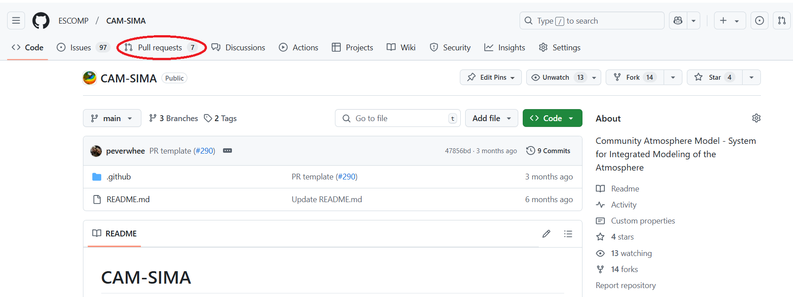
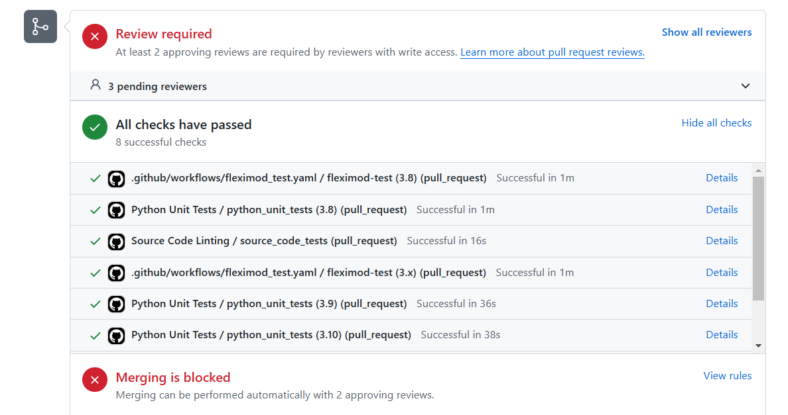

# Development workflow for CAM-SIMA

This page describes the general workflow for adding new development to the [CAM-SIMA repository](https://github.com/ESCOMP/CAM-SIMA).

## Workflow summary

The general workflow for adding a feature, bug-fix, or modification to CAM-SIMA is as follows:

1. [**Open an issue**](#open-an-issue)
1. [**Add your code modifications**](#add-your-code-modifications)
1. [**Open a PR**](#open-a-pr)
    - If you know that this PR will need an official tag, then also add the [tag name](git-basics.md/#tagging-a-commit) to the PR description.
1. **Respond to any reviewer requests.**
1. [**Fix any failing tests**](#fix-failing-tests)
1. [**Run the manual regression tests**](cam-testing.md/#regression-testing)
    - Update `$CAM-SIMA/test/existing-test-failures.txt` if there are new tests failing or if existing test failures have been fixed.
1. **Confirm with the CAM-SIMA gatekeeper that you are OK to merge. Then squash the commits and merge the PR** (e.g. the "squash and merge" option).
1. [**Make a tag (if regression test answers have changed)**](git-basics.md/#tagging-a-commit)
1. [**Archive baselines (if tag has been made)**](cam-testing.md/#archiving-baselines)

## Workflow details

The following sections describe various workflow actions in more detail.

### Open an issue

It is generally recommended to [open an issue](https://github.com/ESCOMP/CAM-SIMA/issues/new) for any new features that will be added or bug that has been found that will need to be fixed. There is currently no offiical requirement on what should be contained within the issue text, so generally just put any information you think might be relevant.

### Add your code modifications

1. If you haven't already, create a fork. Specific instructions can be found [here](git-basics.md/#one-time-github-setup).
1. Create a branch on your fork off of the head of the ESCOMP remote's `development` branch. Specific commands can be found [here](git-basics.md/#working-with-branches)
1. Apply your code modifications and/or script additions, and perform at least one test making sure your modifications work as expected. See below for Git commands for committing to your branch.

There are multiple ways to do commit your changes, but one of the safer ways is to first check your status:
```
git status
```

This will provide a list of all modified files. For each one of those files whose modifications you want to add to the main package, you will do the following:
```
git add updated_fortran_file.F90
```

Where `updated_fortran_file.F90` should be replaced with whatever your file name is. Do this for each file you want to include. If you are confident that every file listed by `git status` needs to be added, then you can do it all at once by doing:
```
git add -A
```

You can then type `git status` again, at which point all of the files you added should be "staged" for commit (green).

To commit your changes to your local branch:
```
git commit -m "<message>"
```

where `<message>` is a short description on sentence stating what the commits are for, e.g. "fixed color bar bug" or "added significance hatching".

To push your changes to your fork:
```
git push
```

or, if you want to be more explicit,

```
git push origin <branch name>
```

### Open a PR

1. Go to the [ESCOMP CAM-SIMA repo](https://github.com/ESCOMP/CAM-SIMA), and click on the "Pull requests" tab.
 
1. There, you should see a "New pull request" button, which you should click.
 
1. On the new "Compare changes" page, you should see a "compare across forks" link, which you should click.
 
1. You should now see two new pull-down boxes (to the right of an arrow). Using these pull-down boxes, select the "development" branch of the ESCOMP repo and select your fork (which should be `<username>/CAM-SIMA`)
1. Then select the branch which contains the commits.
 
1. You should then see a list of all the different modifications. If they generally look correct, click the "Create pull request" button
1. A new page should appear. In the first text box, add the title of your pull request. The second text box will contain additional fields that you should fill out to the best of your ability.
1. If your code changes cause answer changes, you will need a new tag. Enter the expected tag name in the PR description. More on tag conventions [here](git-basics.md/#tagging-a-commit).
1. Add any relevant labels to the PR, add yourself as the assignee, and add any reviewers you would like to have. Otherwise, the core SE team will add reviewers for you.
1. Click "Create pull request"

### Fix failing tests
Failing unit tests will appear at the bottom of the PR page (as shown below). You will also get an email if any tests fail.
 

Click through (via `Details` link) to see the test output of the failing tests. Refer to the table below for debugging failing tests.

| Failing test | Description | Resources |
| ------------ | ----------- | --------- |
| `.github/workflows/fleximod_test.yaml / fleximod-test (<python version>) (pull_request)` | git-fleximod test failure. Likely an invalid external | [git-fleximod testing](cam-testing.md#git-fleximod-tests) |
| `Python unit tests / python_unit_tests (<python version>) (pull_request)` | Python unit test failure. Likely need to update sample files | [Python unit testing](cam-testing.md/#python-unit-testing) |
| `Source Code Linting / source_code_tests (pull_request)` | Python linting failure. Need to fix modified python code. | [Python source code linting](cam-testing.md/#python) |

